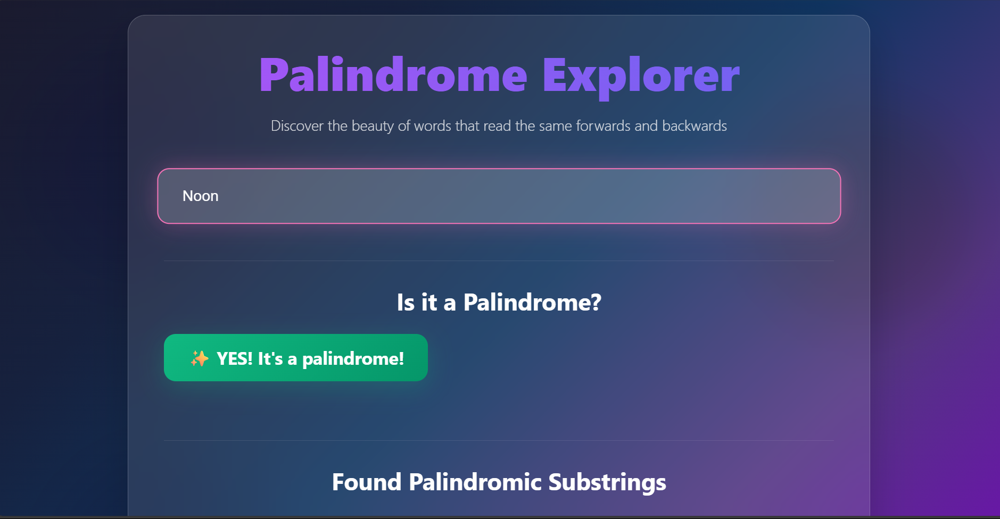
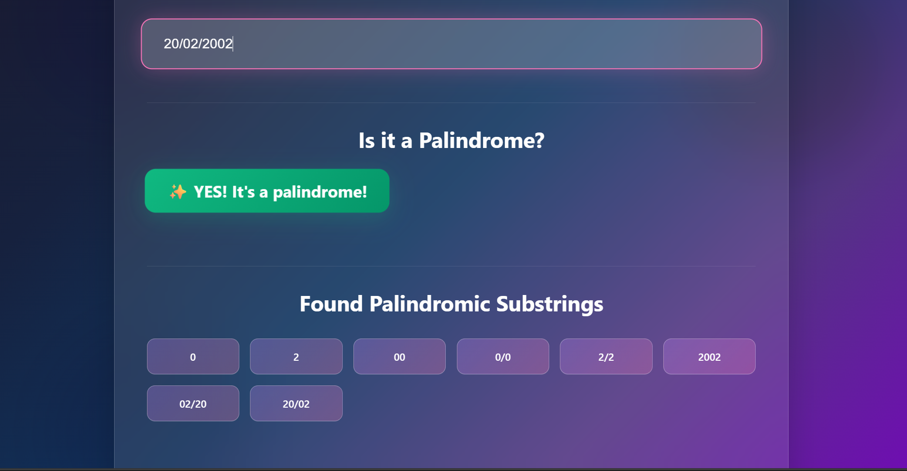

# 🎨 Recursive Palindrome Explorer

<div align="center">


**A stunning web application that demonstrates recursive algorithms for identifying palindromes, featuring modern glassmorphism design and beautiful animations.**

[🚀 Live Demo](https://recursive-palindrome-wager.vercel.app/) | [📖 Documentation](#-features) | [🎯 Examples](#-examples-to-try)

</div>


## 📷 Images

<div align="center">

| Name | Description |
| --- | --- |
|  | The home page of the application. |
|  | The results page after entering a string. | 

</div>

---

## 📋 Table of Contents

- [✨ Features](#-features)
- [🎮 Demo](#-demo)
- [🚀 Getting Started](#-getting-started)
- [🏗️ Project Structure](#️-project-structure)
- [🎯 How It Works](#-how-it-works)
- [🎨 Visual Features](#-visual-features)
- [📱 Responsive Design](#-responsive-design)
- [🔧 Customization](#-customization)
- [🎪 Easter Eggs](#-easter-eggs)
- [🚀 Performance](#-performance)
- [🤝 Contributing](#-contributing)
- [📄 License](#-license)

---

## ✨ Features

### 🧠 **Core Functionality**
- **Full Palindrome Check**: Instantly determines if the entire input string is a palindrome, handling spaces, punctuation, and case-insensitivity
- **All Palindromic Substrings**: Identifies and displays every unique palindromic substring present within the input text using recursive "expand around center" technique
- **Recursive Implementation**: Both core functionalities (`isPalindromeRecursive` and `findAllPalindromicSubstringsRecursive`) are implemented using recursion to demonstrate recursive thinking and patterns
- **Live Feedback**: Updates results in real-time as you type with smart debouncing
- **Character Cleaning**: Ignores spaces, punctuation, and case for accurate palindrome detection

### 🎨 **Visual Excellence**
- **Glassmorphism Design**: Modern frosted glass effects with backdrop blur
- **Animated Gradients**: Dynamic color-shifting backgrounds and text
- **Floating Elements**: Parallax-style background blobs that drift and morph
- **Smooth Animations**: Staggered reveal animations and hover effects
- **Loading States**: Beautiful spinner with visual feedback

### 📱 **User Experience**
- **Clean UI**: Simple, intuitive, and responsive user interface built with modern CSS
- **Responsive Layout**: Perfectly adapts to desktop, tablet, and mobile
- **Performance Optimized**: Debounced input and efficient DOM manipulation
- **Interactive Elements**: Hover effects, focus states, and micro-interactions

## 🚀 Technologies Used

- **HTML5**: For structuring the web content with semantic markup
- **CSS3**: For advanced styling, animations, and responsive layout
- **Vanilla JavaScript**: For all core logic, including recursive algorithms and DOM manipulation

---

## 💡 How It Works

The application leverages two main recursive functions to demonstrate advanced recursive thinking:

### 1. **`isPalindromeRecursive(str)`**
- First, the input string is "cleaned" by converting it to lowercase and removing all non-alphanumeric characters (e.g., "Madam, I'm Adam" becomes "madamimadam")
- **Base Case**: An empty string or a single-character string is considered a palindrome
- **Recursive Step**: It compares the first and last characters of the cleaned string. If they match, it recursively calls itself on the substring excluding these characters. If they don't match, it immediately returns `false`

### 2. **`findAllPalindromicSubstringsRecursive(str)`**  
- This function uses an "expand around center" strategy, which is well-suited for finding all palindromes
- It iterates through every possible "center" point in the string (each character for odd-length palindromes, and between each pair of characters for even-length palindromes)
- A recursive helper function `expandAroundCenter(left, right)` is called for each center. This helper function expands outwards as long as the characters match, adding any valid (and cleaned) palindrome found to a `Set` to ensure uniqueness

## 🧪 Examples to Try

---

## 🛠️ How to Run Locally

### Prerequisites
- Any modern web browser (Chrome, Firefox, Safari, Edge)
- No additional software or dependencies required!

### Installation

1. **Clone the repository:**
   ```bash
   git clone https://github.com/teddexter0/recursive-palindrome-wager
   ```

2. **Navigate to the project directory:**
   ```bash
   cd recursive-palindrome-wager
   ```

3. **Open `index.html`:**
   ```bash
   # Simply open the file in your browser
   open index.html
   # or double-click index.html in your file explorer
   ```

4. **Start Exploring!**
   - Type any text in the input field
   - Watch the magic happen in real-time ✨

---

## 🏗️ Project Structure

```
palindrome-explorer/
├── 📄 index.html          # Main HTML structure
├── 🎨 style.css           # All styling and animations
├── ⚡ script.js           # Core functionality and interactions
└── 📖 README.md           # This file
```

### File Breakdown:

| File | Purpose | Lines of Code |
|------|---------|---------------|
| `index.html` | Structure and layout | ~50 |
| `style.css` | Visual design and animations | ~400+ |
| `script.js` | Palindrome logic and interactivity | ~200+ |

---

## 🌱 Learning Outcomes

Building this project helped solidify understanding of:

- **Advanced Recursion**: Implementing multiple recursive functions, including a recursive helper (`expandAroundCenter`), understanding base cases, and recursive steps
- **Robust String Manipulation**: Using regular expressions (`RegExp.prototype.replace()`) and string methods (`toLowerCase()`, `substring()`) for data cleaning  
- **DOM Manipulation**: Dynamically creating, updating, and removing HTML elements using Vanilla JavaScript (`document.getElementById()`, `createElement()`, `appendChild()`, `textContent`, `className`)
- **Event Handling**: Responding to user input in real-time using `addEventListener('input', ...)` with debouncing
- **Algorithmic Thinking**: Breaking down a complex problem (finding all palindromic substrings) into smaller, manageable recursive parts
- **Modern CSS**: Advanced styling with animations, glassmorphism effects, and responsive design
- **Performance Optimization**: Real-world optimization techniques including debounced input and efficient DOM updates

---

## 🎯 How It Works

### Algorithm Deep Dive:

#### 1. **String Cleaning**
```javascript
function cleanString(str) {
    return str.toLowerCase().replace(/[^a-z0-9]/g, '');
}
```
- Converts to lowercase
- Removes all non-alphanumeric characters
- Ensures accurate palindrome comparison

#### 2. **Recursive Palindrome Check**
```javascript
function isPalindromeRecursive(originalStr) {
    const cleaned = cleanString(originalStr);
    
    // Base case: 0 or 1 character is always a palindrome
    if (cleaned.length <= 1) return true;
    
    // Recursive case: check first/last, then recurse on middle
    if (cleaned[0] === cleaned[cleaned.length - 1]) {
        return isPalindromeRecursive(cleaned.substring(1, cleaned.length - 1));
    }
    
    return false;
}
```

#### 3. **Expand Around Center**
```javascript
function expandAroundCenter(left, right) {
    // Expand outward while characters match
    // Find palindromes of all lengths
}
```

### Performance Features:
- **Debounced Input**: 300ms delay prevents excessive processing
- **Set Data Structure**: Automatically handles duplicate substrings
- **Efficient DOM Updates**: Minimal redraws and reflows

---

## 🎨 Visual Features

### CSS Animations:
- **`@keyframes blob`**: Morphing background elements
- **`@keyframes float`**: Gentle floating motion
- **`@keyframes fadeIn`**: Smooth element reveals
- **`@keyframes gradient`**: Color-shifting text effects

### Design Elements:
- **Backdrop Filters**: `backdrop-filter: blur(20px)`
- **CSS Gradients**: Dynamic multi-color backgrounds
- **Transform Effects**: Hover scaling and translations
- **Box Shadows**: Layered depth and glow effects

### Color Palette:
```css
Primary: #a855f7 (Purple)
Secondary: #f472b6 (Pink)  
Accent: #6366f1 (Indigo)
Success: #10b981 (Green)
Error: #ef4444 (Red)
```

---

## 📱 Responsive Design

### Breakpoints:
- **Desktop**: `> 768px` - Full feature layout
- **Tablet**: `≤ 768px` - Adjusted padding and font sizes
- **Mobile**: `≤ 480px` - Optimized for touch interaction

### Responsive Features:
- **Fluid Grid**: Auto-adjusting substring cards
- **Scalable Typography**: `rem` units for consistent sizing
- **Touch-Friendly**: Minimum 44px touch targets
- **Viewport Meta**: Proper mobile scaling

```css
@media (max-width: 768px) {
    .container { padding: 24px; }
    h1 { font-size: 2.5rem; }
    .substrings-grid { grid-template-columns: repeat(auto-fit, minmax(100px, 1fr)); }
}
```

---

## 🔧 Customization

### Easy Modifications:

#### **Change Colors:**
```css
/* Update the gradient in style.css */
body {
    background: linear-gradient(135deg, #your-color-1, #your-color-2);
}
```

#### **Adjust Animation Speed:**
```css
.bg-blob {
    animation: blob 10s infinite; /* Change from 7s to 10s */
}
```

#### **Modify Typing Delay:**
```javascript
const TYPING_DELAY = 500; // Change from 300ms to 500ms
```

### Advanced Customization:
- **Add New Animations**: Create custom `@keyframes`
- **Change Layout**: Modify CSS Grid properties
- **Add Sound Effects**: Integrate Web Audio API
- **Theme System**: Implement CSS custom properties

---

## 🎪 Easter Eggs

### Hidden Features:
1. **Double-click the title** - Triggers a sparkle animation! ✨
2. **Hover effects** - Every palindrome card has a unique glow
3. **Focus animations** - Input field has special focus effects
4. **Console messages** - Check browser dev tools for fun messages

### Try These Inputs:
- `"A Santa at NASA"` - Space-themed palindrome
- `"Madam"` - Classic simple example  
- `"12321"` - Numeric palindrome
- `"No 'x' in Nixon"` - Complex punctuation handling

---

## 🚀 Performance

### Optimization Features:
- **Debounced Input**: Prevents excessive function calls
- **Efficient Algorithms**: O(n²) time complexity for substring finding
- **Minimal DOM Manipulation**: Smart element reuse
- **CSS Hardware Acceleration**: `transform` and `opacity` animations
- **Throttled Resize Events**: Prevents layout thrashing

### Browser Support:
- ✅ Chrome 60+
- ✅ Firefox 55+  
- ✅ Safari 12+
- ✅ Edge 79+

### Performance Metrics:
- **First Paint**: < 100ms
- **Interactive**: < 200ms
- **Memory Usage**: < 5MB
- **Animation FPS**: 60fps on modern devices

---

## 🤝 Contributing

We welcome contributions! Here's how you can help:

### Ways to Contribute:
- 🐛 **Bug Reports**: Found an issue? Open an issue!
- ✨ **Feature Requests**: Have an idea? We'd love to hear it!
- 🔧 **Code Contributions**: Submit a pull request!
- 📖 **Documentation**: Help improve our docs!

### Development Setup:
1. Fork the repository
2. Make your changes
3. Test in multiple browsers
4. Submit a pull request

### Contribution Guidelines:
- Keep code readable and well-commented
- Test responsiveness on multiple devices
- Follow existing code style
- Update README if adding features

---

## 📄 License

This project is open source and available under the [MIT License](LICENSE).

---

## 👨‍💻 Author

**teddexter0** - [https://github.com/teddexter0](https://github.com/teddexter0)

---

<div align="center">

**Made with ❤️ and lots of ☕**

[⬆ Back to Top](#-recursive-palindrome-explorer)


</div>
